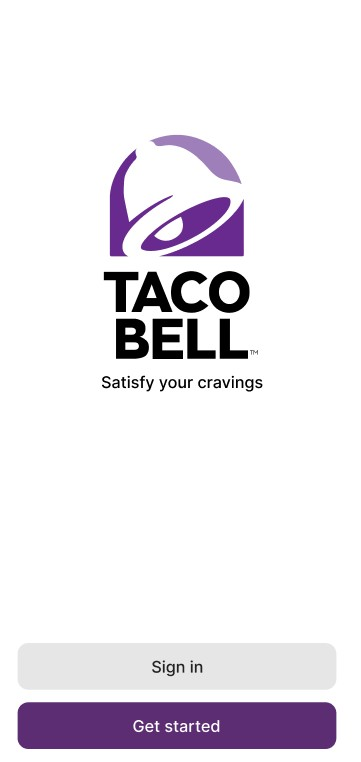
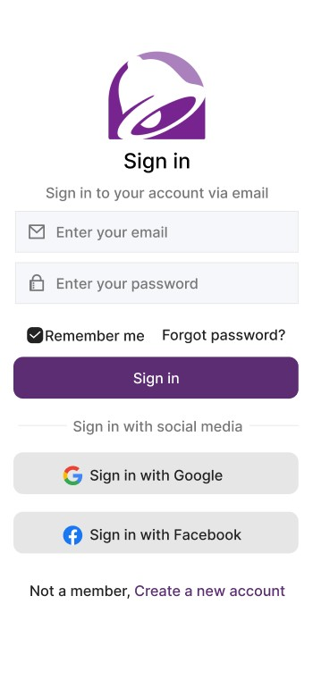
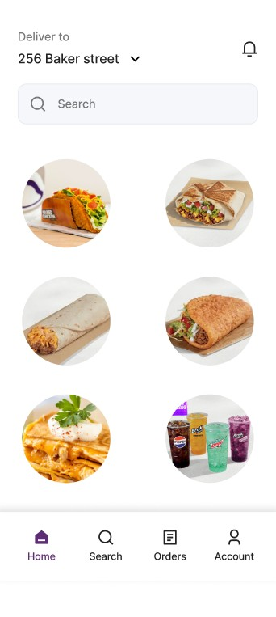

# Taco Bell App UI (Figma Prototype)

This project is a **UI/UX design prototype** created in **Figma**, inspired by the Taco Bell mobile app.  
It is not a functional application — instead, it demonstrates the look and flow of a potential app interface.  

---

## 📱 Screens Designed
The prototype currently includes three key screens:

1. **Splash Screen**  
   - Displays the Taco Bell logo and tagline.  
   - Provides navigation to **Sign In** or **Get Started**.  
   

2. **Login Screen**  
   - Sign in via email and password.  
   - Options to log in with Google or Facebook.  
   - Includes "Remember me" and "Forgot password?" features.  
   

3. **Home Screen**  
   - Delivery location selector and search bar.  
   - Visual menu of food items.  
   - Bottom navigation bar: **Home, Search, Orders, Account**.  
   

---

## 🛠 Tools Used
- **Figma** (for UI/UX design)  
- Exported assets/screenshots for presentation in this repository  

---

## 🚀 How to View
- Screenshots are included in this repo (`page1.jpg`, `page2.jpg`, `page3.jpg`).  
- If you’d like to explore the interactive prototype (if enabled), you can request the Figma link.  

---

## 📌 Notes
- This project is **for educational and portfolio purposes only**.  
- Taco Bell branding, logos, and food images are used here for **practice and design demonstration**.  

---

## ✨ Future Improvements
- Add more screens (cart, checkout, order tracking).  
- Make the prototype interactive in Figma.  
- Potentially implement the design in code (React Native or Flutter).  

---

## 👤 Author
Designed by *[Your Name]*  
📧 Contact: [your.email@example.com]  
🌐 Portfolio: [your-portfolio-link]

